# Cyber-Awareness-Quiz
Cyber Awareness quiz developed and progressed with Python and Streamlit

**Live app:** https://cyber-awareness-quiz-sxt4fcxudusgmzgkeutgcn.streamlit.app/

## Introduction

Autotech Group works mainly in the automotive sector working to source high level candidates to garages in need of extra hands. Autotech also offers various levels of training and allows for college students to gain experience with internships at garages which often result in full-time positions. My role within the company is that of a support and development function. I work to ensure all systems function as they should while also leading projects for the betterment of the business.

Cyber attacks are one of the leading crimes and one of the most expensive both reputationally and financially. It is important to address cyber awareness in organisations so that employees are up to date on various cyber threats. Most people are the most vulnerable part of a business when it comes to cyber defence. That is why training employees and investing in their knowledge becomes so important as cyber threats continue to develop.

What I have spent time creating is a 10-question quiz containing multiple choice and true and false questions covering important cyber topics like phishing, password protection, USB devices, public Wi-Fi and reporting cyber incidents. I have chosen this as it slots in perfectly with the theme for next month which is Cyber Awareness month. This quiz will be used within Autotech alongside other learning platforms like Knowbe4 which is an interactive LMS platform great for pushing and creating content. We also will be running some in person training led by City of London police titled Cyber Griffin, a free program aimed at increasing cyber awareness.

I have chosen to build this product rather than buy was to allow us full control of it, questions can be saved, altered and used for other topics when we need. We can also easily access the CSVs where the data is stored so people with non-technical backgrounds can make changes. No license cost, it runs from a single link, and it is internally owned.

## Design

### GUI Design

I created the wireframes with Figma before code was made, this was done so I could plan each screen and how I wanted the user journey to go

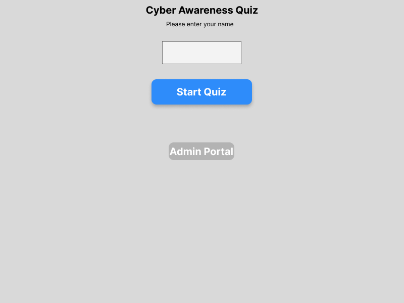


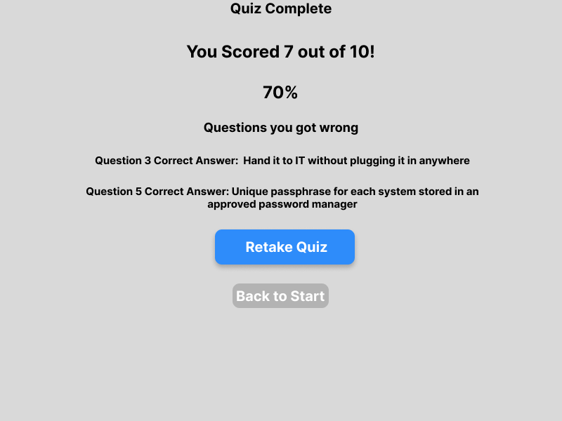

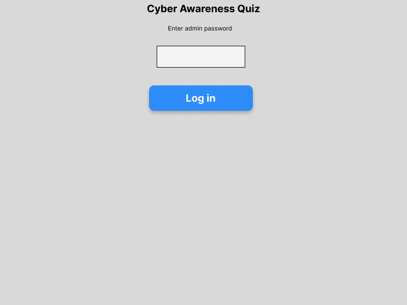

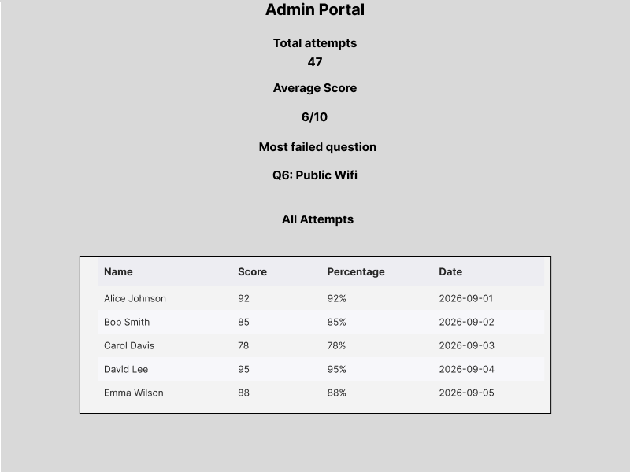

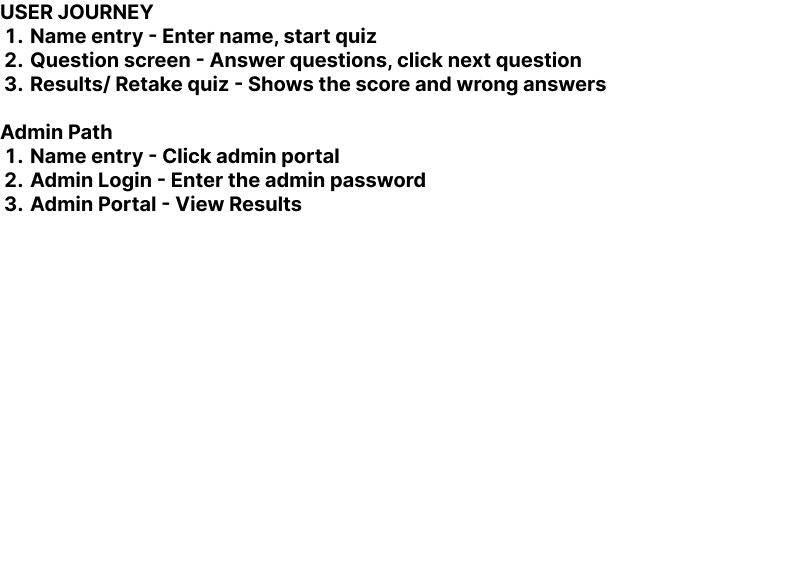

[View the Figma file](https://www.figma.com/design/L7wmKdgztnuQE3VExHbvkR/Untitled?node-id=0-1&t=bi7yH0zIUxEu95DG-1)

### Functional and Non-functional Requirements

| Must have these| Name entry, 10 questions, scoring, results save to CSV, admin dashboard/portal, export answers option |
| Should have these | Show incorrect answers and what it should be, total attempts taken shown |
| Could possibly have these| Score distribution chart, average score, most failed question |
| Will not have these | User accounts, email notifications, a timer to answer the questions in|

#### Functional Requirements

The user must enter a name when the quiz starts for them to continue|
Blank names and ones containing numbers will be rejected and con't carry on |
Questions are created using an editable CSV file|
The application calculates a score out of ten and turns it into a readable percentage|
The results screen shows the score and lists what questions were answered wrong and the correct answer too|
Users can retake as many times as they want|
The admin area requires a password before accessing the dashboard/portal

#### Non-functional Requirements

Can be used with 0 training | One screen at a time and only one action at a time |
Screens responds in a timley manner | Small CSV files |
Invalid formatting will not crash the app| Code can be understood by other devs
Questions editable | Questions held in a CSV file |
Runs on a windows machine | Python 3.9 or above|
The admin password is never stored within the repo| Docstrings used where possible with triple hyphon|

## Development

The app is split into multiple files. `app.py` holds the interface of my app, while the `pcode` holds the important functions

### Question class

```python
class Question:
    """Quiz Question."""

    def __init__(self, question_no, question_txt, options, right_answer):
        """Sets the initial question up"""
        self.question_no = question_no
        self.question_txt = question_txt
        self.options = options
        self.right_answer = right_answer

    def is_right(self, answer):
        """Checks if the answer is correct"""
        return answer == self.right_answer

    def right_answer_txt(self):
        """Collects the correct answer"""
        return self.options.get(self.right_answer, "")
```

This code made a Question class which stores the questions in it. The __init__() saves the question number, the question that was asked, the option picked by the user,and the correct answer. The is_right() method checks if the answer entered by the user is actually the correct one. The right_answer_txt() gets the text of the correct answer from the options dictionary. This makes managment of the questions much easier.

### Calculating the quiz Score

```python
    def score(self):
        """Works out final scored"""
        total = 0

        for question in self.cyber_questions:
            user_answer = self.user_answers.get(question.question_no)

            if user_answer is not None:
                if question.is_right(user_answer):
                    total += 1

        return total

    def wrong_answers(self):
        """Collate list of wrong questions"""
        incorrect_questions = []

        for question in self.cyber_questions:
            user_answer = self.user_answers.get(question.question_no)

            if user_answer is None or not question.is_right(user_answer):
                incorrect_questions.append(question)

        return incorrect_questions
```
This code is used to calculate the quiz score and find out what questions the user got wrong
The score() part goes through each question within the quiz and verifies what the user put in as their answer. If the answer is correct, it adds 1 point to the total score which would be delivered at the end. Once all questions have been checked, it returns the overall score back to the user. The wrong_answers() part goes through all the users questions and does checks to see if they are wrong or missing. If it is, the question is added to a list of incorrect questions which is again displayed at the end for the user to review or try again and get correct. 

### Reading the CSV's Questions

```python
    def load_questions(self):
        """Load the questiosn"""
        loaded_questions = []

        try:
            with open(self.questions_file, newline="", encoding="utf-8") as file:
                reader = csv.DictReader(file)

                for row in reader:
                    options = {}

                    for letter in ["a", "b", "c ", "d"]:
                        option = row.get("option_" + letter, "")
                        option = option.strip()

                        if option != "":
                            options[letter] = option

                    question = Question(
                        int(row["id"]),
                        row["question"],
                        options,
                        row["correct_answer"].strip(),
                    )
                    loaded_questions.append(question)

        except FileNotFoundError:
            raise FileNotFoundError("Could not find this  file: " + self.questions_file)

        return loaded_questions
```
This code loads all the questions from a CSV file into a list. It reads each row of the file then it collects the answer options, and creates a an object using the data gathered. Each question is then added to the loaded_questions list. If the file cannot be found anywhere and error message is produced. This lastly returns the complete list of questions so the rest of the program can access those questions

### Saving an attempt by a user

```python
    def save_attempt(self, name, score, total):
        """Savesquiz attempt"""
        file_exists = os.path.isfile(self.results_file)

        with open(self.results_file, "a", newline="", encoding="utf-8") as file:
            writer = csv.writer(file)

            if not file_exists:
                writer.writerow(["name", "score", "total", "date"])

            writer.writerow(
                [
                    name,
                    score,
                    total,
                    datetime.now(),
                ]
            )
```

This code works to save a user's quiz result to a CSV file. It checks if the results file already exists. If the file does not exist, it creates a header and column with the relevant name. It will then create the users name, score, total number of questions. This means quiz results can be viewed at any point in the future as long as the CSV is intact.

### Validation of Functions

```python
def validate_name(name):
    """Check that a name can be used.

    Args:
        name: the text the user put in.

    Returns:
        A tuple of (True, "") if valid, or (False, reason) if not.
    """
    if name is None:
        return False, "Please enter your name"

    cleaned = name.strip()

    if cleaned == "":
        return False, "Please enter your name"

    if len(cleaned) < 2:
        return False, "Y0ur Name must be at least 2 characters"

    if any(character.isdigit() for character in cleaned):
        return False, "Please don't include numbers in your name"

    return True, ""
```
The validate_name() function checks the name that is entered by the user. It makes sure a name has been entered, is not just empty spaces, is at least 2 characters long, and does not contain any numbers.IF the name fails any one of these checks it will fail and get one of the error messages it relates to.  If the name passes all checks the user will be able to proceed.

### Checking and storing admin password

```python
def hash_password(password):
    """Turns the  password into a hash so that it does not get saved as plain text

    Args:
        password: the text to hash.

    Returns:
        The hash as a string of characters.
    """
    return hashlib.sha256(password.encode()).hexdigest()


def check_password(entered_password, stored_hash):
    """Check a typed password against a stored hash.

    Args:
        entered_password: what the admin typed.
        stored_hash: the hash saved in the secrets file.

    Returns:
        True if they match, otherwise False.
    """
    return hash_password(entered_password) == stored_hash
```
The hash_password() function takes a password and converts it into a scrambled set of characters which is called a hash. This means the real password is not stored as plain text so it essentially makes the program more secure in this case the admin dashboard. The check_password() function checks whether a password entered by the user matches the password stored. If they match the user is granted access if not then they get denied. 


## Testing methods 

Two methods were used to test this project these were with pytest and manual testing. Pytest was used to check the functions created within validation.py. These functions are easy to test because they simpley take in and and give out results. Tests were created to check details like name validation, percentage calculations, and passwords. The tests also checked irregualr situations I created validations for like empty spaces, names that had numbers, names that had spacing, and vey short names with 2 letters. 

Manual testing was used to check parts of the program that involve user interaction. This included sections like question, quiz, and quiz data . The app was ran in the browser using streamlit cloud service. Using both testing methods helped confirm that the program was working as I expected it to do

## Manual test outcomes

###  Manual Testing REults

Testing was completed on a wWindows 11 device and I used Python 3.14.4, and deployed on Stramlit Cloud version.

Valid name gets accepted | I entered a normal name, clicked start quiz| Quiz starts at question 1 |Pass |
Not entering any values for the name | Left the box blank press click Start Quiz | Error shows and quiz does not start |Pass|
A name that has digits does not work | Enter "Todi2" and click Start Quiz | Error about numbers in name |Pass |
You have to pick an answer before continuing | Clicked next without selecting an option | Error shows and stays on same question |Pass |
True or false questions| You have to get to Q6 for these to come up| Two options shown and you pick either True and False |Pass |
Ensure the score is calculated correctly | Answer all 10 counting how many were right | Score matches the number answered correctly |Pass |
 Wrong answers are shown at the end |Answered questions wrong on purpose | Those incorrect answers were listed at the end of the quiz |Pass|
Results are saved to CSV | Complete the quiz then open data/results.csv | New row with name, score, total and date |Pass|
Wrong admin credentials are rejected | Entered the wrong admin password on purpose | "Incorrect password" error and left with no access to results |Pass|

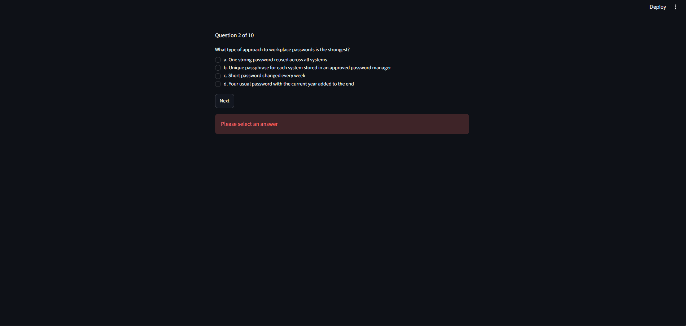

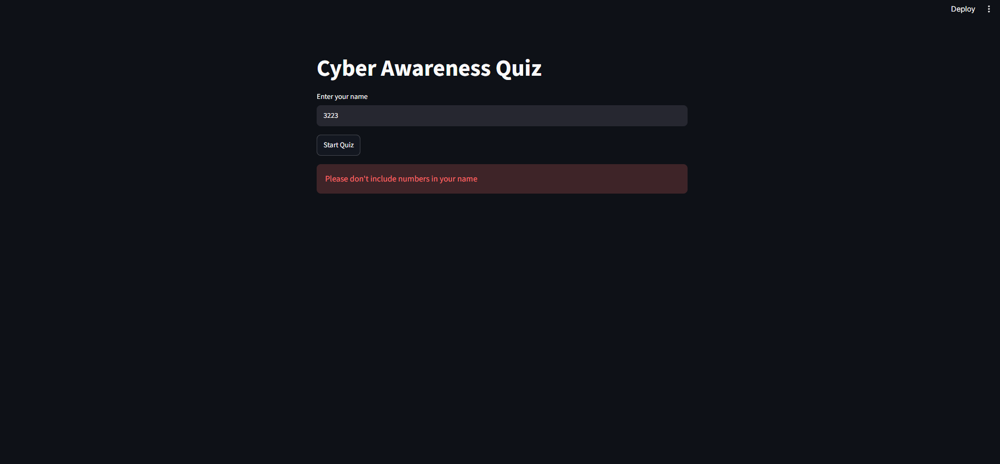

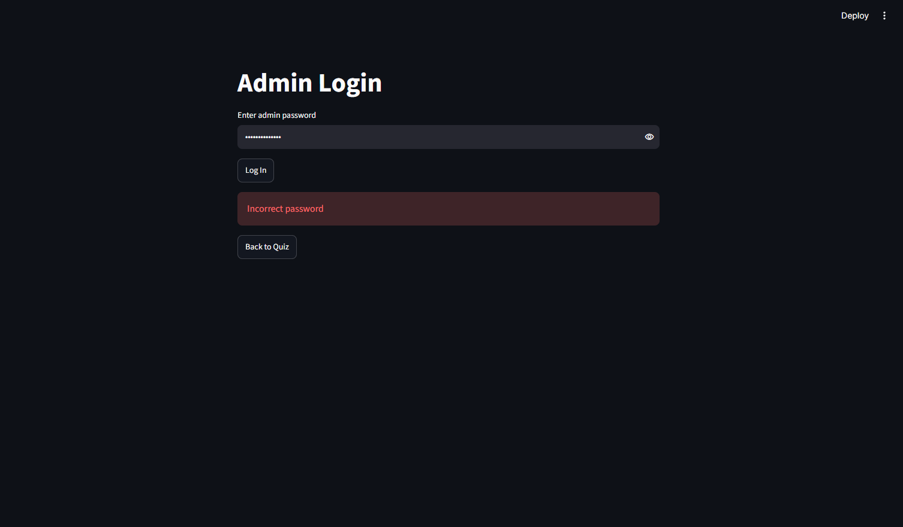

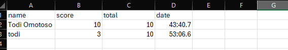

### Unit test outcomes

All 14 pytests were ran using this `pytest -v`.

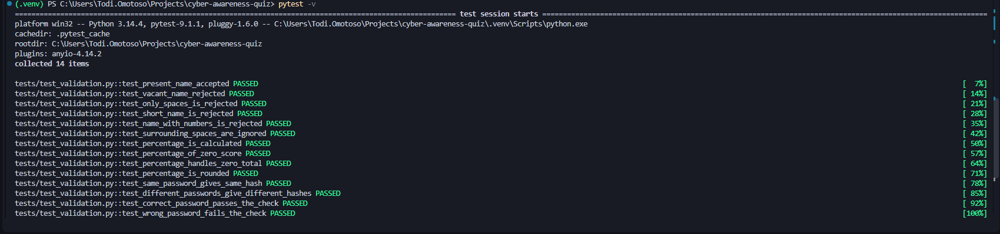


## User documentation

This section explains how employees at Autotech are going to use the app

**Taking the quiz**

1. Open the link: https://cyber-awareness-quiz-sxt4fcxudusgmzgkeutgcn.streamlit.app/
2. Type your name in and start the quiz.
3. Select one answer per question displayed then click next.
4. Repeat for all questions. You cannot continue without selecting a valid answer.
5. Your score appears at the end and comes with  any questions you answered wrong and the correct answers to them too.
6. There is no limit on attampts so you can try again at any point in time

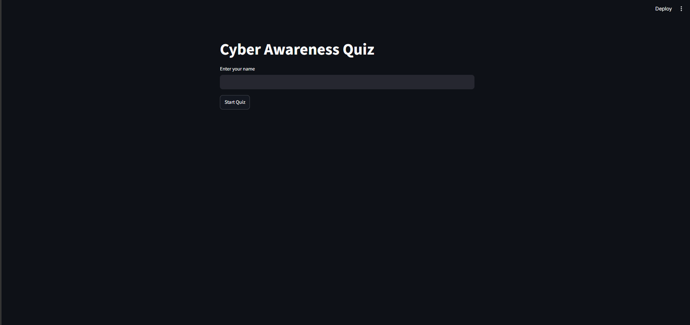

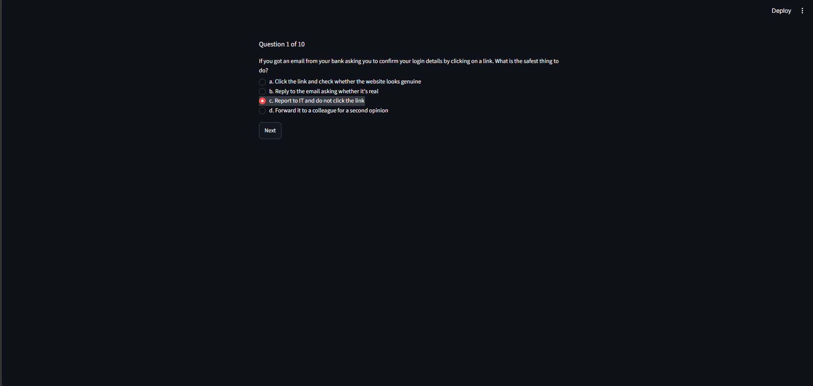

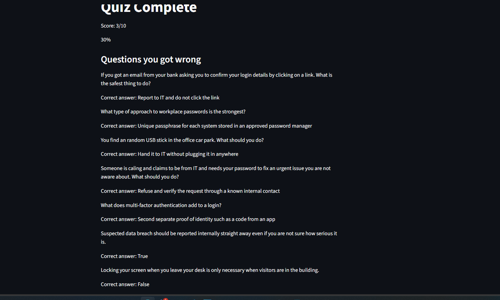

** How to view results on the admin daashbaord/portal**

1. Click the admin portal button on the start screen
2. Enter the correct admin password and press login
3. The dashboard shows the total number of attempts made and the relevant records of each attempt made
4. Click Back to Quiz to leave the admin dashboard page

**Making changes to questions**

The questions live in questions.csv you can easily change whatever question you want while also changing which option is the correct one too

### Technical documentation

**Running the app locally**

git clone https://github.com/beadyhorse50/Cyber-Awareness-Quiz.git
cd Cyber-Awareness-Quiz
python -m venv .venv
.venv\Scripts\activate
pip install -r requirements.txt
streamlit run app.py

**Running unit tests with pytest**

pytest -v


**Setting the admin password**

[Your explanation, about 70 words: generate a hash by running the hash_password function, put it in .streamlit/secrets.toml as ADMIN_PASSWORD_HASH, that file is gitignored so it is never committed, and for the deployed version the same value goes in the Secrets box in the Streamlit Cloud settings]

**Sturucture for the Project**

| `app.py` |This has the Streamlit interface|
| `pcode/questions.py` | The Questions |
| `pcode/quiz.py` | The Quiz scoring and wrong asnwers |
| `pcode/quiz_data.py` | The quiz data and csv reading|
| `pcode/validation.py` |Validation of functions |
| `pcode/admin.py` | Admin dashboard/portal login|
| `data/questions.csv` | The ten questions |
| `data/results.csv` | Saved attempts that are created automatically and saved|
| `tests/test_validation.py` | Unit tests |
| `docs/` | Wireframes, screenshots, requirements text|