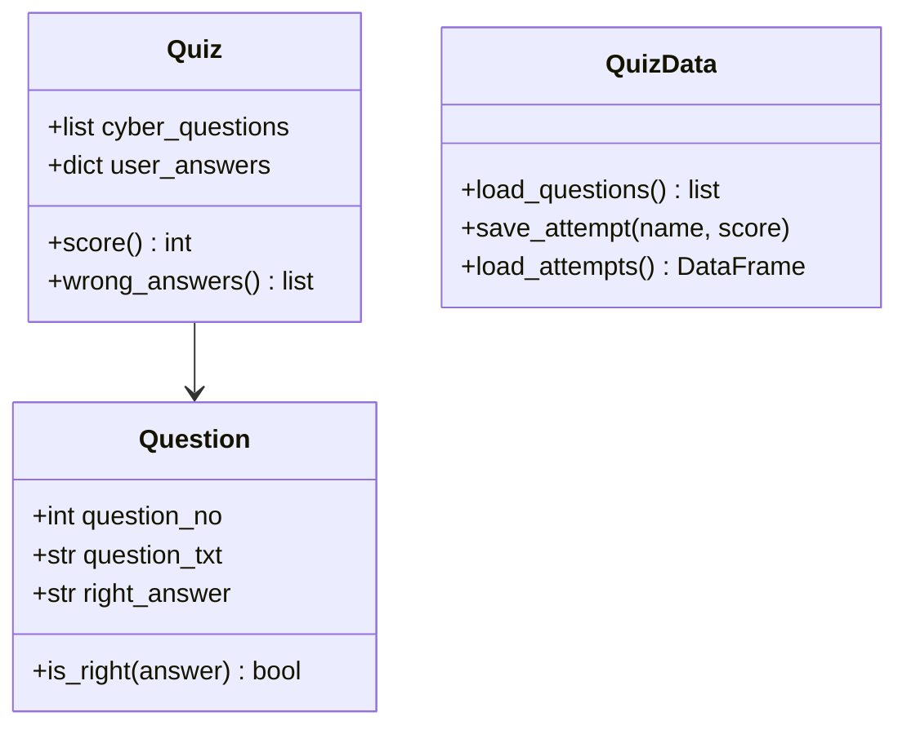

# Design Code

## Diagram

```mermaid
classDiagram
    class Question {
        +int question_no
        +str question_txt
        +str right_answer
        +is_right(answer) bool
    }

    class Quiz {
        +list cyber_questions
        +dict user_answers
        +score() int
        +wrong_answers() list
    }

    class QuizData {
        +load_questions() list
        +save_attempt(name, score)
        +load_attempts() DataFrame
    }

    Quiz --> Question
```
